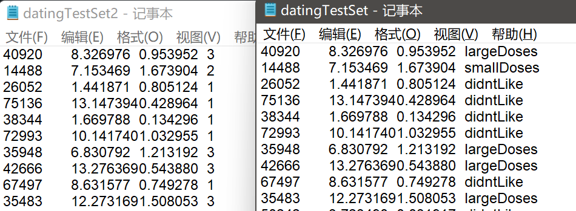
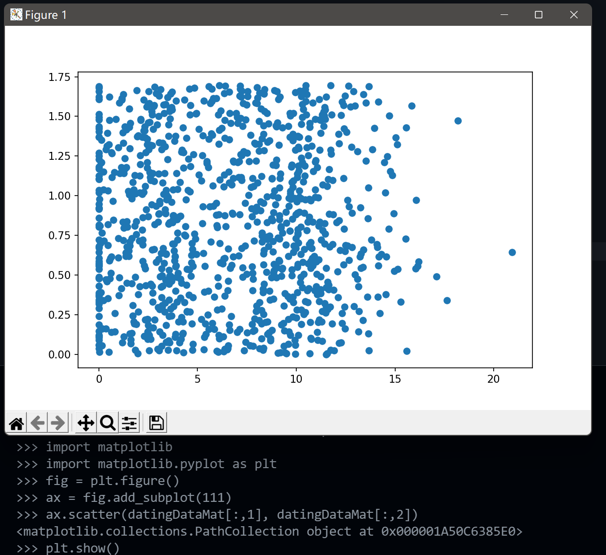
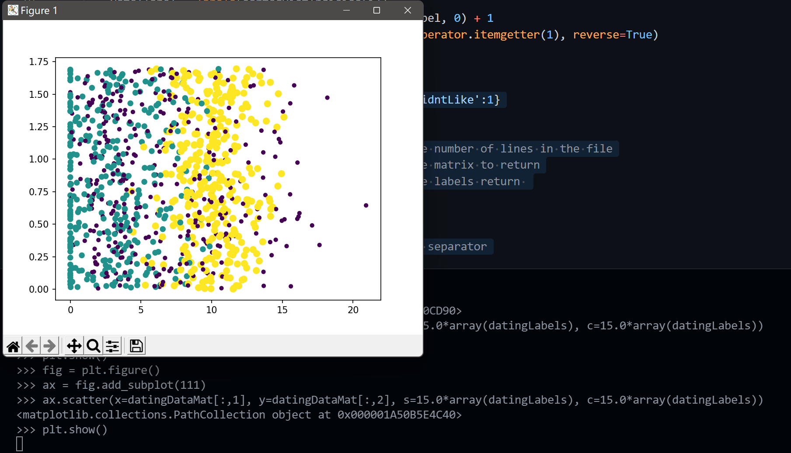
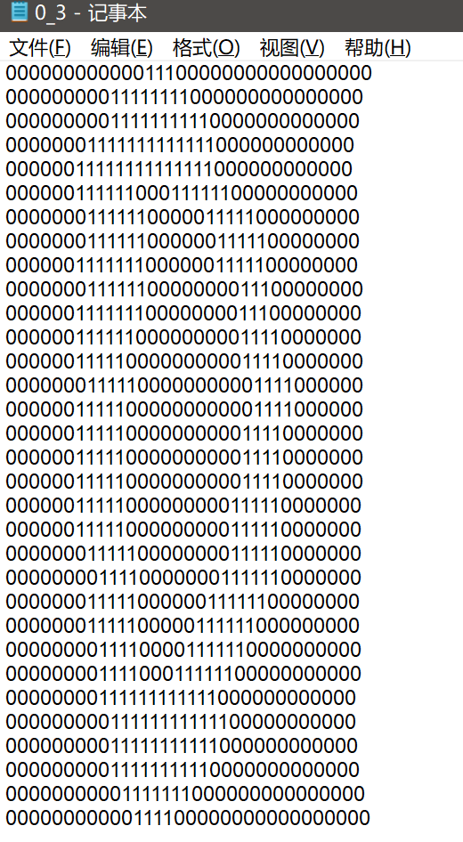

The code for the examples in Ch.2 is contained in the python module: kNN.py.
The examples assume that datingTestSet.txt is in the current working directory.  
Folders testDigits, and trainingDigits are assumed to be in this folder also.  

# Chapter02: kNN

存在一个**已知标签**的**训练数据集**。输入**无标签**的新数据后，根据新数据的样本特征与样本数据进行比较，然后提取样本集中特征**最相似**数据（最近邻）的分类标签。一般选择前***k***个最相似的数据中出现次数最多的分类作为新样本的分类。

# Prerequisite

```python
pip install numpy
pip install matplotlib
```

## kNN步骤

1. 计算已知标签样本点与查询点的距离；
2. 按照距离递增次序排序；
3. 选取与查询点距离最小的k个点；
4. 确定前k个点的标签频率
5. 返回前k个点频率最高的标签作为查询点的预测分类

## python (v3.8) 实现

```python
from numpy import *
import operator

def createDataSet():
    group = array([[1.0,1.1], [1.0,1.0], [0,0], [0,0.1]])
    labels = ['A', 'A', 'B', 'B']
    return group, labels

def classify0(inX, dataSet, labels, k):
    dataSetSize = dataSet.shape[0]
    diffMat = tile(inX, (dataSetSize,1)) - dataSet
    sqDiffMat = diffMat**2
    sqDistances = sqDiffMat.sum(axis=1)
    distances = sqDistances**0.5
    sortedDistIndicies = distances.argsort()
    classCount={}
    for i in range(k):
        voteIlabel = labels[sortedDistIndicies[i]]
        classCount[voteIlabel] = classCount.get(voteIlabel, 0) + 1
    sortedClassCount = sorted(classCount.items(), key=operator.itemgetter(1), reverse=True)
    return sortedClassCount[0][0]
```

In python prompt 

```bash
import kNN
group,label = kNN.createDataSet()
kNN.classify0(inX=[0,0], dataSet=group, labels=label, k=3)

# 'B'
```

以上构建了简单的kNN分类方法。

## kNN应用实例-约会网站

接下来，使用kNN改进约会网站的配对效果

### 探索数据

首先，我们从github repo上下载相应的约会数据

```bash
wget https://raw.githubusercontent.com/pbharrin/machinelearninginaction/master/Ch02/datingTestSet.txt
wget https://raw.githubusercontent.com/pbharrin/machinelearninginaction/master/Ch02/datingTestSet2.txt
```



第一列：每年获取的飞行里程数

第二列：玩游戏所耗时间百分比

第三列：每周所消费的冰淇淋公斤数

第四列：标签（datingTestSet = character; datingTestSet2 = int）

创建函数 `file2matrix()` 转换文本的数据为matrix对象

```python
def file2matrix(filename):
    love_dictionary={'largeDoses':3, 'smallDoses':2, 'didntLike':1}
    fr = open(filename)
    arrayOLines = fr.readlines()
    numberOfLines = len(arrayOLines)            #get the number of lines in the file
    returnMat = zeros((numberOfLines,3))        #prepare matrix to return
    classLabelVector = []                       #prepare labels return 
    index = 0
    for line in arrayOLines:
        line = line.strip()
        listFromLine = line.split('\t')         #define separator
        returnMat[index, :]  = listFromLine[0:3]
        if(listFromLine[-1].isdigit()):
            classLabelVector.append(int(listFromLine[-1]))
        else:
            classLabelVector.append(love_dictionary.get(listFromLine[-1]))
        index += 1
    return returnMat,classLabelVector
```

在python命令行

```python
from importlib import reload
reload kNN
datingDataMat,datingLabels = kNN.file2matrix('datingTestSet2.txt')

datingDataMat
```

```python
array([[4.0920000e+04, 8.3269760e+00, 9.5395200e-01],
       [1.4488000e+04, 7.1534690e+00, 1.6739040e+00],
       [2.6052000e+04, 1.4418710e+00, 8.0512400e-01],
       ...,
       [2.6575000e+04, 1.0650102e+01, 8.6662700e-01],
       [4.8111000e+04, 9.1345280e+00, 7.2804500e-01],
       [4.3757000e+04, 7.8826010e+00, 1.3324460e+00]])
```

```python
datingLabels[0:10]
```

```python
[3, 2, 1, 1, 1, 1, 3, 3, 1, 3]
```

接下来，使用 `matplotlib` 做一点数据可视化探索。

取数据的第二列和第三列做散点图



使用标签值作为散点**大小**和**颜色**的属性



这里要注意python的函数传入参数时，要么是位置参数式传入，要么是键值式传入，而不能混用。

### 准备数据

为了消除不同数据量纲的差异，定义函数 `autoNorm` 进行归一化

```python
def autoNorm(dataSet):
    minVals = dataSet.min(0)
    maxVals = dataSet.max(0)
    ranges = maxVals - minVals
    normDataSet = zeros(shape(dataSet))
    m = dataSet.shape[0]
    normDataSet = dataSet - tile(minVals, (m,1))
    normDataSet = normDataSet/tile(ranges, (m,1))   #element wise divide
    return normDataSet, ranges, minVals
```

$normValue = (rawValue - min)/(max - min)$

```python
>>> reload(kNN)
>>> normMat,ranges,minVals = kNN.autoNorm(datingDataMat)  
>>> normMat
array([[0.44832535, 0.39805139, 0.56233353],
       [0.15873259, 0.34195467, 0.98724416],
       [0.28542943, 0.06892523, 0.47449629],
       ...,
       [0.29115949, 0.50910294, 0.51079493],
       [0.52711097, 0.43665451, 0.4290048 ],
       [0.47940793, 0.3768091 , 0.78571804]])
>>> ranges
array([9.1273000e+04, 2.0919349e+01, 1.6943610e+00])
>>> minVals     
array([0.      , 0.      , 0.001156])
```

### 测试算法

接着，我们使用之前定义的 `classify0` 对归一化后的约会数据进行kNN分类，并截取前10%的数据作为测试集以测试分类器的错误率

```python
def datingClassTest():
    hoRatio = 0.10    #hold out 10% for test set
    datingDataMat, datingLabels = file2matrix('datingTestSet2.txt')    #load data set from file
    normMat, ranges, minVals = autoNorm(datingDataMat) 
    m = normMat.shape[0]    #number of rows
    numTestVecs = int(m*hoRatio)    #set first 0.1*m rows as test set
    errorCount = 0.0
    for i in range(numTestVecs):
        classifierResult = classify0(normMat[i,:], normMat[numTestVecs:m, :], datingLabels[numTestVecs:m], 3)
        print("The classifier came back with: %d, the real answer is: %d" % (classifierResult, datingLabels[i]))
        if (classifierResult != datingLabels[i]): errorCount += 1.0
    print("------------")
    print("The total error rate is: %f" % (errorCount/float(numTestVecs)))
    print("The total number of error calling is: %f" % errorCount)
```

> 注意：在python中进行向量运算一般使用循环的方式
> 

```python
>>> reload(kNN)
>>> kNN.datingClassTest()
The classifier came back with: 3, the real answer is: 3
The classifier came back with: 2, the real answer is: 2
The classifier came back with: 1, the real answer is: 1
...
The classifier came back with: 1, the real answer is: 1
The classifier came back with: 3, the real answer is: 1
------------
The total error rate is: 0.050000
The total number of error calling is: 5.000000
```

分类器处理约会数据集的错误率为5%，与原书中的2.4%有出入，可能是由于数据变更引起的。改变输入数据、测试集的大小和k值都会影响分类器的输出结果。

### 使用算法

接下来，我们通过接受新的用户数据里使用上述构建的kNN分类器

```python
def classifyPerson():
    resultList = ['not at all', 'in small doses', 'in large doses']
    percentTats = float(input("percentage of time spent playing video games?"))
    ffMiles = float(input("frequent flier miles earned per year?"))
    iceCream = float(input("liters of ice cream consumed per year?"))
    datingDataMat, datingLabels = file2matrix('datingTestSet2.txt')
    normMat, ranges, minVals = autoNorm(datingDataMat)
    inArr = array([ffMiles, percentTats, iceCream, ])
    classifierResult = classify0((inArr - minVals)/ranges, normMat, datingLabels, 3)
    print("You will probably like this person: %s" % resultList[classifierResult - 1])
```

当使用该函数时，命令行进入交互框，请求用户输入相应数据。在函数内部对输入数据归一化后，进行分类。最后，返回分类结果。

```python
>>> reload(kNN)
>>> kNN.classifyPerson()
percentage of time spent playing video games?10
frequent flier miles earned per year?10000
liters of ice cream consumed per year?0.5
You will probably like this person: in small doses
```

## kNN应用实例—手写识别系统

这个例子使用kNN分类器构建手写识别系统。书中提供的实例数据是预先经过转换的32x32的数字文本文件，例如：



为了应用之前构建的kNN函数，我们需要将32x32的数字矩阵转换为1x1024的向量。

```python
def img2vector(filename):
    returnVect = zeros((1,1024))
    fr = open(filename)
    for i in range(32):
        lineStr = fr.readline()
        for j in range(32):
            returnVect[0,32*i+j] = int(lineStr[j])
    return returnVect
```

接着，使用 `trainingDigits\` 下的文件作为训练集，使用 `testDigits\` 下的文件作为测试集测试分类器的效果。

```python
def handwritingClassTest():
    hwLabels = []
    trainingFileList = listdir('trainingDigits')           #load the training set
    m = len(trainingFileList)
    trainingMat = zeros((m,1024))    #each image per line
    for i in range(m):    #construct training matrix and labels vector
        fileNameStr = trainingFileList[i]
        fileStr = fileNameStr.split('.')[0]     #take off .txt
        classNumStr = int(fileStr.split('_')[0]) #image class labels are stored at the first letter of the file
        hwLabels.append(classNumStr)    
        trainingMat[i,:] = img2vector('trainingDigits/%s' % fileNameStr)
    testFileList = listdir('testDigits')        #iterate through the test set
    errorCount = 0.0
    mTest = len(testFileList)
    for i in range(mTest):
        fileNameStr = testFileList[i]
        fileStr = fileNameStr.split('.')[0]     #take off .txt
        classNumStr = int(fileStr.split('_')[0])
        vectorUnderTest = img2vector('testDigits/%s' % fileNameStr)
        classifierResult = classify0(vectorUnderTest, trainingMat, hwLabels, 3)
        print("the classifier came back with: %d, the real answer is: %d" % (classifierResult, classNumStr))
        if (classifierResult != classNumStr): errorCount += 1.0
    print("\nthe total number of errors is: %d" % errorCount)
    print("\nthe total error rate is: %f" % (errorCount/float(mTest)))
```

```python
>>> kNN.handwritingClassTest()
the classifier came back with: 0, the real answer is: 0
the classifier came back with: 0, the real answer is: 0
...
the classifier came back with: 9, the real answer is: 9
the classifier came back with: 9, the real answer is: 9

the total number of errors is: 10

the total error rate is: 0.010571
```

该分类器错误率为1.05%。由于本例没有给额外的待分类图像，就到此为止了。

如果我们想要实际开发一个手写字体分类器，我们需要：

1. 构建图像识别系统以实现图像到数值的转换。
2. 转换数值文本文件为向量
3. 测试分类器
4. 使用分类器对新的图像进行分类

## kNN小结

- 优点：精度高、对异常值不敏感、无数据输入假定
- 缺点：计算复杂度高、空间复杂度高
- kNN算法是分类数据最简单、有效的算法。但是当训练数据集很大时，就会占用大量存储空间。同时，由于需要计算每个数据的距离值，需要耗费大量计算资源
- 另一个缺陷是他无法给出任何数据的基础结构信息（？）